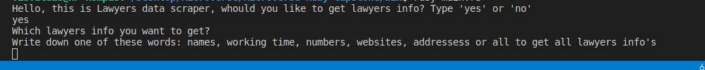
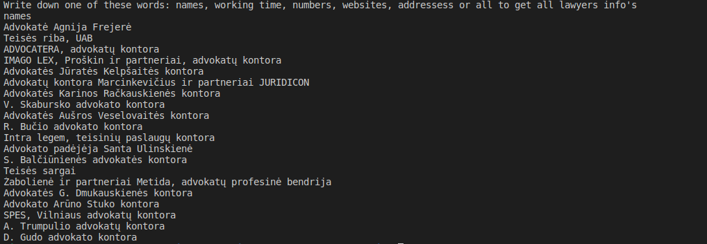

# Microverse-Ruby-Capstone
Web scraper project for Microverse Ruby Capstone

## Description

This project demonstrates an example of Web scraping by retrieving data from the [info.lt](https://www.info.lt/rubrika/Advokatai/100209472) webpage and presenting it to the user.


The Scraper presents retrieved data to the user depended on their selection or response :

- **Choice 1** : User need's to choose to run scraper or not
- **Choice 2** : Choose what info they want to get - All lawyers info or just a names, addresses, website links or working times.


  Choices |
  -----------|
   |
  
  Choice to show lawyers names |
  -----------|
   |

  ## How to run this Scraper
  > This scraper can run on your computer or online.


### Run it On your computer

#### Pre-requisites
1. You should have [Ruby](https://www.ruby-lang.org/en/) installed on your computer.
1. Your computer should be able to run `terminal` or `command prompt` or `bash` or `Powershell` commands.

#### Using a Repository
1. Run this command `git clone https://github.com/visva-dev/Microverse-Ruby-Capstone.git` in the desired folder to clone the repository on to your local machine.
After cloning the project, you should cd into the directory where the code is stored & nevigate into bin older using `cd bin`

1. Then run to following command install the necessary dependencies

```bash
    bundle install
```

3. And last command to run the scraper

```bash
    ruby bin/main.rb
```
4. And you should see a welcome message indicating the scraper has opened and ready for work, follow the instructions and you will get data which you need.

### B. Online

1. click the following link  [Scraper's link](https://repl.it/@visvaldeliss/scraper#main.rb)
1. When the link has been opened, click the `green run button` you will see at the top to run the Scraper.

## Demo Video

Click the following [link](https://www.loom.com/share/377fc1646c154ef1b7b01b2bb6d3405e) to see Video presentation of the project.

  ## How to run Rspec tests:
  > When you are in `Microverse-Ruby-Capstone` folder, open your terminal & run `rspec` program will run tests for this project.

  ## Built With

  - Ruby
  - Nokogiri Gem

  ## Tested With

  - Rspec

  ## Authors

  👤 **Visvaldas Rapalis**

- Github: [@visva-dev](https://github.com/visva-dev)
- Twitter: [@Visva_Dev](https://twitter.com/Visva_Dev)
- Linkedin: [@Visvaldas-Rapalis](https://www.linkedin.com/in/visvaldas-rapalis)


## Show your support

Give a ⭐️ if you like this project!

## Acknowledgments

- This project was inspired by the [Microverse](https:www.microverse.org) program

## 📝 License

This project is [MIT](lic.url) licensed.